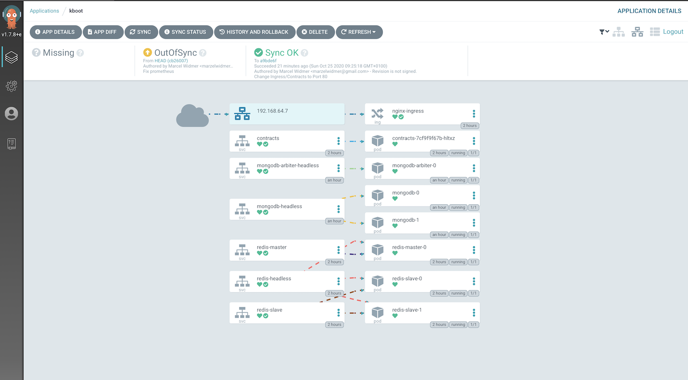

# argo-demo
Argo CD - Demo Project
 




## Install Argo CLI
```
brew install argocd
brew install sops
```


## Install ARGO
```
kubectl create namespace argocd
kubectl apply -n argocd -f https://raw.githubusercontent.com/argoproj/argo-cd/stable/manifests/install.yaml
```


## Port Forwarding to ARGO Server
```
kubectl port-forward svc/argocd-server -n argocd 8080:443
```


## Change Argo Admin Password
The default Password is the Argo Server name.
```
kubectl get pod -n argocd | grep argocd-server
argocd-server-5bc896856-xvt92                    1/1     Running   0          71m
```
Use the Argo CLI to login with user `admin` and change the password.
```
argocd login localhost:8080
argocd account update-password
```

# Create App with directory-recurse
```
argocd app create kboot --repo https://github.com/marzelwidmer/argo-demo.git --path manifest  --directory-recurse --dest-server https://kubernetes.default.svc --dest-namespace default
```
## Test Contracts inside K8s
```
kubectl run -i --rm --restart=Never curl-client --image=tutum/curl:alpine --command -- curl -s 'http://contracts/api/persons' -H 'Content-Type: application/json' -w "\n"

[{"firstName":"John"}]
pod "curl-client" deleted
```

## Test Contracts oder Ingress
See also : [Blog Minikube Ingress Controller](https://blog.marcelwidmer.org/posts/2020-05-01-minikube-ingress-controller) 
```
http -j http://test.minikube.me/api/persons

HTTP/1.1 200 OK
Connection: keep-alive
Content-Encoding: gzip
Content-Type: application/json
Date: Sun, 25 Oct 2020 08:34:33 GMT
Matched-Stub-Id: e6546194-eda5-4d86-b644-9694fd421ed6
Server: nginx/1.19.1
Transfer-Encoding: chunked
Vary: Accept-Encoding, User-Agent

[
    {
        "firstName": "John"
    }
]

```

## Synch App
```
argocd app sync kboot
```


# TODO`s
## Sealed Secrets
Install Sealed Secrets with Helm to manage Secrets. 
see: https://hub.kubeapps.com/charts/stable/sealed-secrets
```
helm install sealed --namespace kube-system stable/sealed-secrets
```
### Install client-side tool into /usr/local/bin/
```
GOOS=$(go env GOOS)
GOARCH=$(go env GOARCH)
wget https://github.com/bitnami-labs/sealed-secrets/releases/download/v0.12.4/kubeseal-$GOOS-$GOARCH
sudo install -m 755 kubeseal-$GOOS-$GOARCH /usr/local/bin/kubeseal
```
### Create a sealed secret file for Redis
```
kubectl create secret generic redis --dry-run=client --from-literal=database-password=verySecurePassword -o yaml | \
 kubeseal \
 --controller-name=sealed-sealed-secrets \
 --controller-namespace=kube-system \
 --format yaml > sealed-redis-secret.yaml
```
### Apply the sealed secret
```
kubectl create -f sealed-redis-secret.yaml
```
### Get Secret
Running `kubectl get secret redis -o yaml` will show the decrypted secret that was generated from the sealed secret.
Both the SealedSecret and generated Secret must have the same name and namespace.
```
kubectl get secret redis -o yaml
```
See:
https://github.com/bitnami-labs/sealed-secrets
